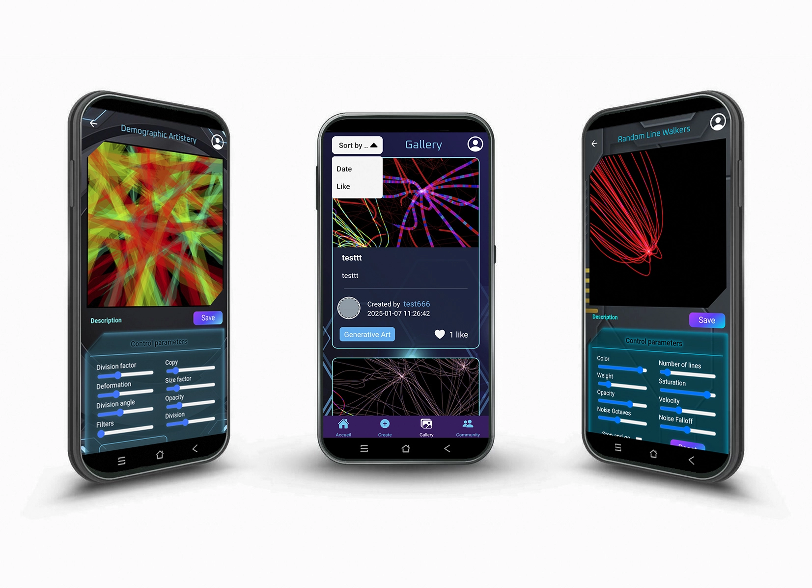

# NexusLab 🎨💻
**NexusLab** is a collaborative platform blending art and technology. It allows users to manipulate, create, and share digital artworks generated by creative coding algorithms.  

  


## 📋 Table of Contents  
- [Project Overview](#project-overview)  
- [Technologies Used](#technologies-used)  
- [Installation](#installation)  
- [Usage](#usage)  
- [Accessibility](#accessibility)  
- [Documentation and Download](#documentation-and-download)  
- [Screenshots](#screenshots)  
- [Contributing](#contributing)  
- [License](#license)  

---

## 📖 Project Overview  
NexusLab is designed to make digital artistic practices such as *generative art* and *data art* accessible to both beginners and experts.  
The project is available as **web and mobile versions**, offering a seamless and secure experience with modern technologies.

---

## 🚀 Technologies Used  
- **Frontend Web**: Twig, Symfony UX React
- **Backend**: Symfony (PHP)  
- **Mobile**: React Native  
- **Database**: MySQL  
- **Others**: Webpack Encore, Babel, Expo, Axios, Jwt Decode

---

## 📦 Installation and Setup (Developer Guide)  

### Prerequisites  
Ensure you have the following installed:  
- **Node.js** (>= 14.x)  
- **Composer** (for Symfony)  
- **Expo CLI** (for React Native)  

### Steps  
1. Clone the repository:  
   ```bash
   git clone https://github.com/PatrickTaburet/nexus-lab-project.git
   cd nexus-lab-project
   ```  
2. Install dependencies:  
   - Web (Symfony):
   ```bash
   cd symfony
   composer install
   ```  
   - Mobile (React Native):
   ```bash
   cd mobile/nexuslab_mobile
   npm install
   ```  
3. Start the development server:  
   ```bash
   - Web (Symfony):
      cd symfony
      php -S 0.0.0.0:8000 -t public
   ```  
   ```bash
   - Mobile (React Native):
      cd mobile/nexuslab_mobile
      npx expo start
   ```  

---

## 📱 Usage (Tester Guide)
- **Web Frontend**: Accessible at `http://localhost:8000`  
- **Mobile**:
   1. Ensure you have the Expo Go app installed on your mobile device.
   2. Run the mobile app with the command npx expo start in the mobile/nexuslab_mobile directory.
   3. Scan the QR code using the Expo Go app to launch the app on your phone.

---

## ♿ Accessibility  
Efforts have been made to ensure accessibility:  
- Proper HTML tags for semantic structure.  
- Full keyboard navigation on the web version.  
- Alternative text for images.  
- `accessibilityLabel` and `accessible` attributes in React Native.  

---

## 📄 Documentation and Download  
You can download the project documentation (PDF version) in french here:
[Download NexusLab Project PDF](./doc/DOSSIER_PROJET_NEXUS_LAB-Taburet_Patrick.pdf)

---

## 🖼️ Screenshots
Here are some screenshots of the NexusLab project in action:

   ### Web Interface:
      - Home Page
       

      - Public Gallery
       

      - Generative Art Scene
       

      - Data Art Scene
       

   ### Mobile Interface:
      - Connexion Screens Overview
       

      - Application Overview
       

---

## 🤝 Contributing  
Contributions are welcome! Please follow these steps:  
1. Fork the project.  
2. Create a new branch (`feature/branch-name`).  
3. Make your changes and commit (`git commit -m "Add feature X"`).  
4. Open a Pull Request.  

---

## 📄 License  
This project is licensed under the Creative Commons Attribution-NonCommercial 4.0 International License.
You are free to:

Share: Copy and redistribute the material for non-commercial purposes.
Modify: Adapt and build upon the material as long as credit is given.
Full License Text
[Full License Text](https://creativecommons.org/licenses/by-nc/4.0/)

---

## 📧 Contact  
If you have any questions or suggestions, feel free to reach out at:
Patrick Taburet - patrick.taburet@nexuslab.com